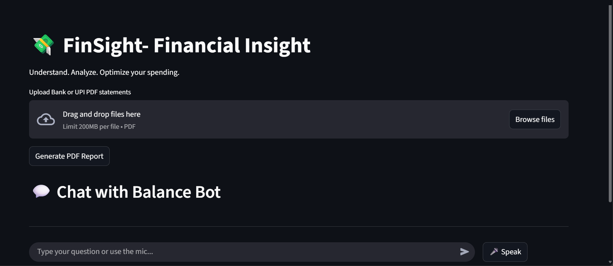
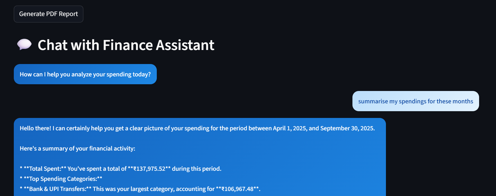
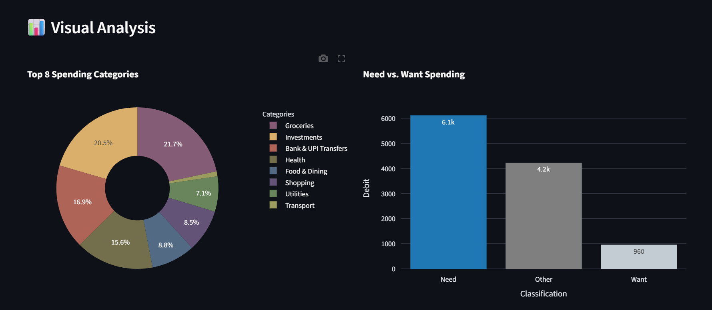
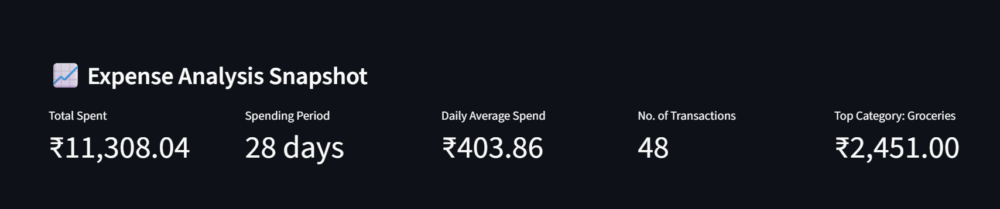

# 💸 FinSight — Smart Personal Finance Analyzer

> Turn your transaction data into financial insights.
> FinSight is an intelligent web application that simplifies your money management by analyzing your bank and UPI statements, automatically categorizing expenses, and presenting insights through clean, interactive dashboards.

---

## 🚀 Overview

FinSight is a **Streamlit-based personal finance application** that helps users gain control over their spending habits.  
Simply upload your **bank or UPI PDF statements (Google Pay, PhonePe, Paytm, etc.)**, and FinSight will:

- Extract and clean your transaction data  
- Categorize each expense automatically using **Gemini AI**  
- Classify transactions into **Needs vs. Wants**  
- Visualize spending patterns through interactive charts  
- Provide detailed **monthly and category-wise insights**

FinSight saves you hours of manual tracking and helps you make informed financial decisions.

---

## ✨ Features

- 📂 **Multi-Statement Upload:** Upload multiple PDF bank or UPI statements at once.  
- 🧹 **Automated Data Cleaning:** Removes duplicates and formats all data into a unified structure.  
- 🤖 **AI Categorization:** Uses **Gemini API** via LangChain to auto-classify transactions.  
- 💡 **Needs vs. Wants Analysis:** Distinguishes essential and non-essential spending.
- 💬 **Chatbot with Speech Input:** Interact with FinSight through voice or text.  
  - Ask questions like *“How much did I spend on food last month?”*  
  - Get instant insights from your transaction data.  
- 📊 **Interactive Visual Dashboard:** Explore insights with dynamic charts and filters.  
- 🧾 **PDF Report Generation:** Download your analysis as a professional summary report.  
- 🔔 **Expense Alerts:** Detect upcoming large or recurring expenses (e.g., fees, subscriptions).

---

## 🧠 Tech Stack

| Layer | Technologies |
|:------|:--------------|
| **Frontend** | Streamlit, HTML, CSS |
| **Backend** | Python (Pandas, NumPy) |
| **AI Integration** | Gemini API (via LangChain) |
| **Visualization** | Matplotlib, Plotly |
| **Storage** | Local File System |
| **Deployment** | Streamlit Cloud / Localhost |

---

## 🧩 System Flow
PDF Input → Parsing & Cleaning → AI Categorization → Visualization → Insights Report

---

## ⚙️ Installation

Clone this repository and set up the environment:

```bash
git clone https://github.com/yourusername/finsight.git
cd finsight
pip install -r requirements.txt
streamlit run app.py
```
---

## 📸 Screenshots

| Dashboard View | Chatbot with Speech Input |
|-----------------|---------------------------|
|  |  |

| Visual Section | Expense Insights |
|----------------|-------------------|
|  |  |

---

## 🧾 Usage

1. Launch the Streamlit app.  
2. Upload your bank and UPI statement PDFs.  
3. Let **FinSight** extract and categorize all transactions.  
4. View detailed insights and download your summary report.

---

## 📈 Future Enhancements
  
- 📱 Integrate SMS parsing for offline expense tracking  
- ☁️ Connect with Google Sheets or bank APIs  
- 🧭 Introduce goal-based budgeting and forecasting  

---

## 🤝 Contributing

Contributions are welcome!  
If you’d like to improve **FinSight**:

1. Fork the repository  
2. Create your feature branch (`git checkout -b feature-name`)  
3. Commit your changes (`git commit -m "Add new feature"`)  
4. Push to the branch (`git push origin feature-name`)  
5. Open a Pull Request  

---

## 🌟 About the Developer

**👩‍💻 Dilnaz Grewal**  
> Passionate about building intelligent systems that combine **data science** and **web development** to create impactful real-world solutions.

📫 Connect on [LinkedIn](https://www.linkedin.com/in/dilnazgrewal05/) • [GitHub](https://github.com/dilnazgrewal)
